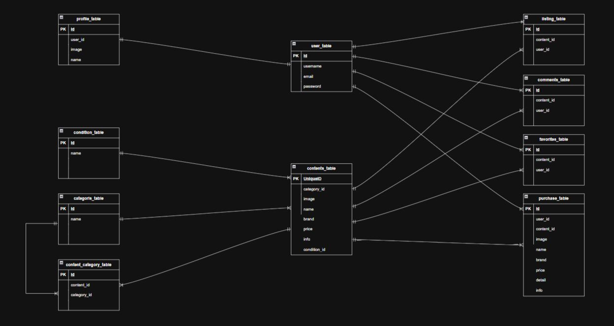

# hurima
模擬案件「フリマ」

## 環境構築
**Dockerビルド**
1. git clone git@github.com:syamuichigo/hurima.git
2. DockerDesktopアプリを立ち上げる
3. docker-compose up -d --build
* MySQLはOSによって起動しない場合があるのでそれぞれのPCに合わせてdocker-compose.ymlファイルを編集してください

**Laravel環境構築**
1. docker-compose exec php bash
2. composer install
3. .env.exampleファイルから.envを作成
4. .envに以下の環境変数を追加
```
DB_CONNECTION=mysql
DB_HOST=mysql
DB_PORT=3306
DB_DATABASE=laravel_db
DB_USERNAME=laravel_user
DB_PASSWORD=laravel_pass
```
5. .envに以下の環境変数を削除
``` 
MAIL_FROM_ADDRESS=null
```
6. アプリケーションキーの作成
``` bash
php artisan key:generate
```
7. マイグレーションの実行
``` bash
php artisan migrate
```
8. シーディングの実行
``` bash
php artisan db:seed
```
## 使用技術(実行環境)
- PHP 7.4-fpm
- Laravel 8.75
- MySQL 8.0.26
## ER図


## テストユーザー情報
- name : test
- email : test@example.com
- password : password

## URL
- 開発環境：http://localhost/
- phpMyAdmin:：http://localhost:8080/